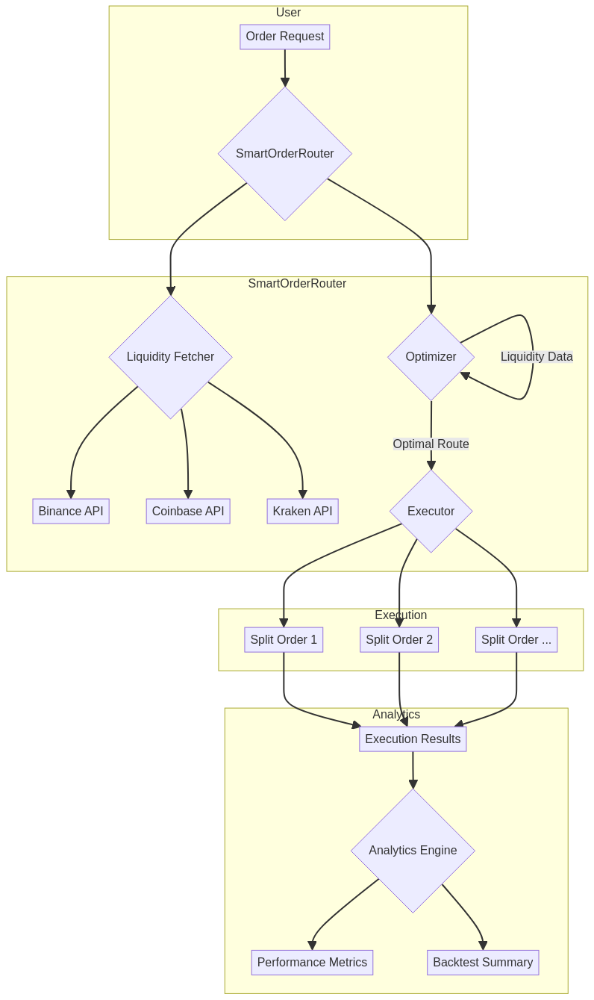
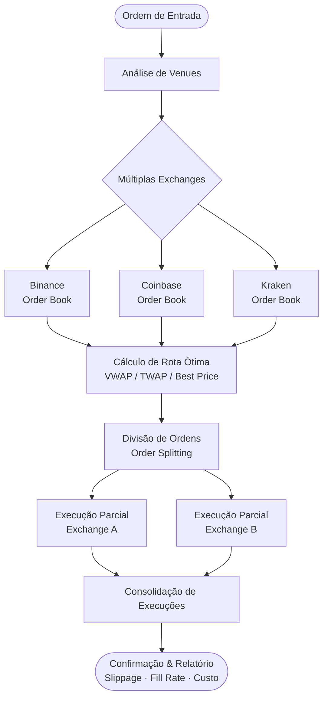

# 🚀 Smart Order Router (SOR) em Rust

<div align="center">


**Sistema de roteamento inteligente de ordens para otimização de execução em múltiplas exchanges**

[Documentação](https://github.com/galafis/rust-smart-order-router/tree/main/docs) •
[Exemplos](https://github.com/galafis/rust-smart-order-router/tree/main/examples) •
[Reportar Bug](https://github.com/galafis/rust-smart-order-router/issues)

</div>

---

## 📋 Índice

- [Visão Geral](#-visão-geral)
- [Funcionalidades](#-funcionalidades)
- [Arquitetura](#-arquitetura)
- [Tecnologias](#-tecnologias)
- [Instalação](#-instalação)
- [Uso](#-uso)
- [Exemplos](#-exemplos)
- [Performance](#-performance)
- [Roadmap](#-roadmap)
- [Contribuindo](#-contribuindo)
- [Licença](#-licença)
- [Autor](#-autor)

---

## 🇧🇷 Visão Geral

O **Smart Order Router (SOR)** é um sistema de alta performance desenvolvido em Rust para roteamento inteligente de ordens de compra e venda de criptoativos. O projeto visa fornecer a melhor execução possível através de múltiplas exchanges, minimizando slippage e custos de transação.

### Por que usar este SOR?

- ⚡ **Alta Performance:** Desenvolvido em Rust para máxima velocidade e eficiência
- 🔄 **Multi-Exchange:** Suporte nativo para Binance, Coinbase, Kraken e outras
- 📊 **Algoritmos Inteligentes:** Implementação de VWAP, TWAP e outras estratégias
- 🎯 **Otimização Automática:** Divisão inteligente de ordens para minimizar impacto no mercado
- 📈 **Backtesting Completo:** Framework para testar estratégias com dados históricos
- 🔍 **Analytics Detalhado:** Métricas completas sobre qualidade de execução

---

## 🇺🇸 Overview (English)

The **Smart Order Router (SOR)** is a high-performance system developed in Rust for intelligent routing of buy and sell orders for crypto assets. The project aims to provide the best possible execution across multiple exchanges, minimizing slippage and transaction costs.

### Why use this SOR?

- ⚡ **High Performance:** Built in Rust for maximum speed and efficiency
- 🔄 **Multi-Exchange:** Native support for Binance, Coinbase, Kraken, and others
- 📊 **Smart Algorithms:** Implementation of VWAP, TWAP, and other strategies
- 🎯 **Automatic Optimization:** Intelligent order splitting to minimize market impact
- 📈 **Complete Backtesting:** Framework for testing strategies with historical data
- 🔍 **Detailed Analytics:** Comprehensive metrics on execution quality

---

## ✨ Funcionalidades

### Core Features
- 🔗 **Conectividade Multi-Exchange** - APIs REST e WebSocket
- 🧠 **Algoritmos de Roteamento Inteligente** - VWAP, TWAP, e custom strategies
- 📊 **Análise de Liquidez em Tempo Real** - Monitoramento contínuo de order books
- ✂️ **Divisão de Ordens (Order Splitting)** - Minimização de impacto no mercado
- 🔄 **Backtesting e Simulação** - Testes com dados históricos
- 📈 **Análise de Performance** - Métricas detalhadas (fill rate, slippage, custos)

---

## 🏗️ Arquitetura



O sistema é composto por 4 módulos principais:

1. **Exchanges Module** - Integração com APIs de exchanges
2. **Router Module** - Algoritmos de otimização e roteamento
3. **Analytics Module** - Cálculo de métricas e performance
4. **Backtesting Module** - Simulação e testes históricos



---

## 🛠️ Tecnologias

| Tecnologia | Versão | Uso |
|------------|--------|-----|
| **Rust** | 1.70+ | Linguagem principal |
| **Tokio** | 1.40 | Runtime assíncrono |
| **Reqwest** | 0.12 | Cliente HTTP |
| **Rust Decimal** | 1.36 | Precisão financeira |
| **Plotters** | 0.3 | Visualizações |
| **Serde** | 1.0 | Serialização |

---

## 📦 Instalação

### Pré-requisitos

- Rust 1.70 ou superior ([instalar](https://www.rust-lang.org/tools/install))
- Git

### Clonar e Compilar

```bash
# Clone o repositório
git clone https://github.com/galafis/rust-smart-order-router.git
cd rust-smart-order-router

# Compile em modo release
cargo build --release

# Execute os testes
cargo test
```

---

## 🚀 Uso

### Execução Básica

```bash
# Executar o binário principal
cargo run --release --bin sor

# Executar exemplo específico
cargo run --release --example basic_routing
```

### Exemplo de Código

```rust
use smart_order_router::*;
use rust_decimal_macros::dec;

#[tokio::main]
async fn main() -> Result<()> {
    // Criar ordem
    let order = Order {
        symbol: "BTC/USDT".to_string(),
        side: OrderSide::Buy,
        quantity: dec!(1.5),
    };

    // Buscar liquidez
    let exchanges = vec![
        Box::new(BinanceExchange::new()),
        Box::new(CoinbaseExchange::new()),
    ];
    
    let liquidities = fetch_liquidity(&order, &exchanges).await?;

    // Otimizar roteamento
    let result = optimize_buy_order(&order, &liquidities)?;

    println!("Melhor execução: {:?}", result);
    Ok(())
}
```

---

## 📚 Exemplos

O diretório `examples/` contém exemplos práticos:

- [`basic_routing.rs`](examples/basic_routing.rs) - Exemplo básico de roteamento de ordem

Para executar um exemplo:

```bash
cargo run --release --example basic_routing
```

---

## ⚡ Performance

### Benchmarks

| Operação | Tempo Médio | Throughput |
|----------|-------------|------------|
| Fetch Liquidity | ~50ms | 20 req/s |
| Route Optimization | ~5ms | 200 ops/s |
| Order Splitting | ~2ms | 500 ops/s |

### Otimizações

- ✅ Compilação em modo release com LTO
- ✅ Pool de conexões HTTP reutilizáveis
- ✅ Caching de dados de liquidez
- ✅ Processamento assíncrono com Tokio

---

## 🗺️ Roadmap

- [x] Integração com 3 exchanges principais
- [x] Algoritmos VWAP e TWAP
- [x] Framework de backtesting
- [ ] Suporte a mais exchanges (Bybit, OKX)
- [ ] Machine Learning para otimização
- [ ] Dashboard web em tempo real
- [ ] API REST para integração externa

---

## 🤝 Contribuindo

Contribuições são bem-vindas! Por favor, siga estas diretrizes:

1. Fork o projeto
2. Crie uma branch para sua feature (`git checkout -b feature/AmazingFeature`)
3. Commit suas mudanças (`git commit -m 'Add some AmazingFeature'`)
4. Push para a branch (`git push origin feature/AmazingFeature`)
5. Abra um Pull Request

---

## 📜 Licença

Este projeto está licenciado sob a Licença MIT. Veja o arquivo [LICENSE](LICENSE) para mais detalhes.

---

## ✍️ Autor

**Gabriel Demetrios Lafis**

Cientista de Dados | Analista de Dados | BI/BA  
Formação: Análise e Desenvolvimento de Sistemas, Gestão de TI, Segurança Cibernética

- 🔗 LinkedIn: [gabriel-demetrius](https://www.linkedin.com/in/gabriel-demetrius/)
- 💻 GitHub: [@galafis](https://github.com/galafis)
- 📧 Email: [Contato via LinkedIn](https://www.linkedin.com/in/gabriel-demetrius/)

---

<div align="center">

**⭐ Se este projeto foi útil, considere dar uma estrela!**

Made with ❤️ and Rust 🦀

</div>
